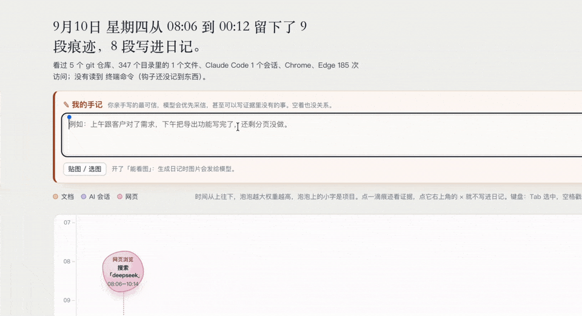
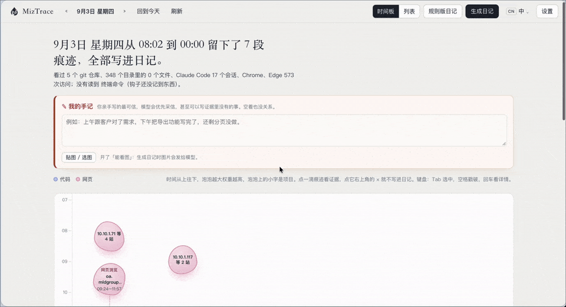
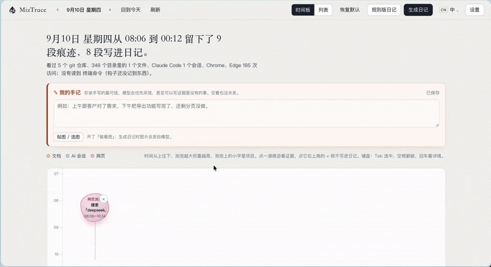

<p align="center"></p>
<h1 align="center">MizTrace</h1>
<p align="center">What did you actually do today? It collects the traces and writes a diary where <b>every sentence links back to its evidence</b>.</p>
<p align="center"><a href="./README.md">中文</a></p>

---

By the end of a day your work is scattered everywhere: files you edited, commits you made, questions you asked an AI tool, pages you read, commands you typed. MizTrace gathers those traces on your machine and lays them out on a time board. You pop the ones you don't want, add what the computer couldn't see, and hand the rest to a model you configure to write a proper diary.

Zero dependencies. No network by default. Works without an API key. macOS and Windows.

## Up and running in a minute

Needs Node 22.13+ (or 23.4+). No third-party packages, no `npm install`.

```bash
git clone https://github.com/MIZHOUCL/MizTrace.git
cd MizTrace
node bin/miztrace.js ui
```

A local page only you can reach opens in your browser. The first visit asks where to look and which sources to read; suggested folders, detected browsers and AI tools are pre-checked. Click "Start collecting".

To install it as a global command:

```bash
npm link
miztrace ui
```

## Two minutes a day, three moves

Open the page and today's traces are already on the board: time runs top to bottom, each bubble is one stretch of work, bigger means more weight, and clicking one shows every piece of evidence behind it. There are only three things for you to do.

### 1. Things the computer never saw: write a line yourself

<p align="center"></p>

A meeting, a phone call, a decision you made in your head: none of that leaves a trace on disk. Write a line in "My notes" and paste an image if you like (a screenshot, a photo of the whiteboard). Notes are the highest-priority evidence: the model follows them first and may even write things no trace shows. Leaving it empty is fine.

### 2. Things the computer only half knows: add a note to the bubble

<p align="center"></p>

Browser history knows you spent 36 minutes on bilibili. It doesn't know why. Open the bubble and tell it "looking for English listening material" in the note box, and that is what the diary says instead of a flat "browsed bilibili". Bubble notes rank the same as your notes and can carry images too.

### 3. Things you don't want in the diary: pop them

<p align="center"></p>

Personal stuff, slacking, searches unrelated to work: click the × on the bubble, or the red button in the drawer. The bubble turns dashed, the count in the headline drops by one, an "Undo" toast appears, and ↺ brings it back any time. Never want a project to show up at all? The drawer has "Exclude project forever".

Then click "Write with AI". Before anything is sent you see every byte that will go to the model; confirm, and the diary is ready in a minute or two. Not happy? Pick another template and write again. No model configured? The rules-based diary works and saves the same way.

<details>
<summary>What a generated diary looks like (example)</summary>

```markdown
# 2026-09-10

## Overview

- Met three vendors in the morning, aligned scope and pricing for the third-party service; comparison table due next week.
- Finished pagination for the export feature and merged it; the red CI turned out to be tests pinned to the local timezone, green after fixing.
- Spent half an hour on bilibili in the evening finding English listening material.

## Notes

**Morning: vendor meeting** 10:00 three vendors walked through their proposals; the disagreement was about tiered usage pricing. Drafted the comparison table afterwards.

**Afternoon: pagination and CI** From 14:20 added pagination on the export branch; CI went red after the 15:40 push. Asked Claude Code to look: two tests had hard-coded 08:00Z as 16:00 Shanghai time, which never matches on GitHub's UTC runners. Pinned the tests to one timezone, all 167 passed, merged at 17:05.

**Evening: English** From 23:23 watched the "train your listening" series on bilibili for about 36 minutes.
```

The saved file is exactly this: clean Markdown. In the UI, each paragraph also carries the evidence it cites; click it to see which prompt, file or page it came from.

</details>

## Why it is worth using

**Other tools ask you to remember. This one lays the evidence out.** Writing a work log is hard because you forget, not because you can't write. MizTrace reads what really happened: git commits, changed files, what you asked your AI tools and what they finally answered, browser history with dwell time, shell commands. You only make choices.

**Every sentence links back to a source.** Each paragraph of the AI diary maps to concrete evidence. The model cannot invent things the evidence doesn't contain, and if it does, the line is flagged. The saved file is a clean diary with no footnotes.

**It knows AI tools, lots of them.** Claude Code, Codex, Gemini CLI, Cursor, Cline, Windsurf, Trae, opencode, aider, Copilot and more: 25 adapters that read your prompts and each tool's final reply. The diary says "I had Codex change X and it replaced Y", not just "used AI".

**Reads like a diary, not a log.** Two layers: a short "Overview" of what got done, then first-person "Notes" on where you got stuck and how you got out. Four built-in templates (summary, timeline, review, brief), all editable.

**Works for non-coders too.** A day of spreadsheets, documents and meetings still yields a diary from document outlines, browsing history and your notes.

**Privacy is the default, not an option.** Reads only the folders you pick, never file contents or diffs; browser and shell are off by default; data lives in a local SQLite; the only outbound request is the one you confirm. Managed machines can disable outbound traffic permanently. One-click Chinese / English UI.

## What it reads

| Source | What | Default |
|---|---|---|
| git | Today's commits, working-tree changes, repos cloned today | on |
| SVN | Today's commits and local uncommitted changes in working copies | off |
| Files | Files changed or created today under your folders (path and time only); outlines of docx / xlsx / pptx / md / pdf | on |
| AI sessions | Your prompts, commands / files the tool touched, first 300 chars of each final reply | on |
| Notes | What you write and paste yourself | on |
| Browser | Page titles, URLs without parameters, search terms, dwell time (Chrome, Edge, Safari, Firefox, Arc and more) | off |
| Shell | Commands you type and their folder (via a small shell hook) | off |

`miztrace sources` lists what this machine can actually read, including which SVN working copies live under your folders.

SVN is off by default for a concrete reason: `svn log` queries the repository server, whereas git log / git status are entirely local. When enabled it still only reads revision, author, time, commit message and changed paths — never diff bodies. Set `svn.remote: false` to record only local uncommitted changes, fully offline.

## Commands

| Command | Does |
|---|---|
| `miztrace ui` | Web UI: board, notes, AI writing, settings |
| `miztrace today` | Today's rules-based diary in the terminal |
| `miztrace date 2026-09-03` | A specific day |
| `miztrace week` | Last 7 days |
| `miztrace write` | AI diary from the CLI; `--preview` shows the payload without sending |
| `miztrace sources` | What can be read on this machine |
| `miztrace shell-hook --install` | Install the shell hook |
| `miztrace where` | Data and config paths |
| `miztrace purge --yes` | Delete all local data |

Common options: `--root <dir>` (repeatable, the important one), `--out <dir>` (where diaries go, e.g. an Obsidian vault), `--author <name or email>`, `--tz Asia/Shanghai`, `--cutoff 4`, `--no-svn` (skip SVN this run).

## Model setup

Settings in the UI takes three fields: Base URL, API key, model name. DeepSeek, OpenRouter, Ollama and most others are OpenAI-compatible (end the URL at `/v1`); Anthropic is detected from the URL. Hit "Test connection". There is no other switch.

Use the provider's stable model name (`deepseek-chat`, `deepseek-reasoner`, …). Time-limited names containing `expires` / `preview` often keep returning 200 with empty content after they are retired; MizTrace then reports "the model returned empty content" and suggests switching. Reasoning models (DeepSeek V4 flash / reasoner, o-series) spend "Max output" on thinking first; with a small budget nothing of the answer comes back. MizTrace detects this, retries once with more (at least 16000 for reasoning models, 8000 for plain truncation) and saves the working value to Settings. OpenAI-style `max_completion_tokens` / no-`temperature` quirks are adapted automatically from the 400 message.

Tick "Model supports images" for multimodal models to send images from notes as originals.

## Privacy details

- Reads only folders under `--root` and each AI tool's own session directory. Skips dotfiles, `node_modules`, and files like `.env` / `*.pem` / `id_rsa` (not even the path is recorded).
- Files: path, time, size only. Documents: heading levels / sheet names / slide titles only.
- Sessions: no thinking, no tool output, no code blocks.
- Shell commands containing `password=`, `token=`, `export XXX_KEY=` never enter the local database.
- Before sending: home-directory, email / phone / IP redaction; suspected secrets abort the request.
- Outbound code lives only in `src/ai/`; the local server only in `src/server/`, bound to 127.0.0.1. CI greps both boundaries.
- `managedDevice: true` in `config.json` disables all outbound traffic permanently; the UI deliberately has no switch for it.

Data directory: macOS `~/Library/Application Support/miztrace`, Windows `%APPDATA%\miztrace`; override with `MIZTRACE_DATA_DIR`.

## Roadmap: from recording to using

Today MizTrace gets each day right. Once the diaries pile up, they can do much more than be re-read. Three stages: **record** (now) → **accumulate** (turn diaries into a profile of what you can do) → **use** (let that profile work for you).

| Stage | Module | In one line | Status |
|---|---|---|---|
| Record | Daily diary | traces → board → diary, every sentence backed by evidence | available |
| Record | Plugins | new sources and outputs: drop a file in and it works | planned |
| Record | Obsidian plugin | collect, pop bubbles and write inside Obsidian; diaries land in your vault | planned |
| Accumulate | My skills | a skill profile grown from your diaries, each skill with evidence | planned |
| Use | Precision strike | paste a job description, get a tailored résumé that only states true things | planned |
| Use | Weekly / yearly reports | roll daily diaries up into something you can hand in | idea |

### Plugins: sources and outputs both pluggable

The 25 AI-tool adapters live in `src/collect/providers/` today, and adding one means touching core code. The plan is two plugin contracts: a source plugin is a folder that implements `detect()` and `collect()` and works as soon as it is dropped into the plugin directory; an output plugin does the same for where the diary goes: Obsidian, Logseq, Notion, Feishu Docs, or anywhere you like. When a new tool ships, someone can have an adapter the same day without waiting for a release.

### Obsidian plugin: diaries straight into your vault

`--out` already writes Markdown into an Obsidian vault. The next step is a proper Obsidian plugin: collect, pop bubbles and write from inside Obsidian, no browser tab. Diaries get frontmatter (date, projects, tags), note images go to the attachment folder, project names auto-link to project notes, and Dataview can answer "which projects did I touch this month" or "which days was I on X".

### My skills: a capability profile grown from diaries

One day's diary says what you did; a hundred days say what you can do. This module reads your diaries periodically and groups what keeps recurring into skills: Vue, PostgreSQL tuning, cross-team coordination, English listening… Open any of them and you see three things:

- **How far you have got**: how often you touched it in the last three months, how deep, leading or assisting.
- **Why we say you have it**: which days' diaries, which commits, which AI sessions. Same iron rule as always: every line links back to evidence, and a skill without evidence never appears.
- **How it grew**: a timeline from first contact to now.

Side effect: a skill untouched for six months fades to grey, a nudge that it is going stale.

### Precision strike: one job description, one résumé

With the skill profile, everything you are capable of sits in a local database. Paste a job description and it picks, requirement by requirement, the best-matching skills and stories from the profile, then generates a résumé tailored to that job (Markdown / PDF) with a source next to every claim, for you to check before you send.

It also produces **interview ammunition**: for each requirement in the JD, one real thing you did, laid out as situation, task, action, result, ready for "tell me about a hard problem you solved".

It does not make things up: a skill that is not in the profile does not appear on the résumé. That is what makes it more trustworthy than polishing a résumé with a general-purpose AI, and why you can send it with a straight face.

### Other ideas

- **Weekly / monthly / year-end reports**: roll daily diaries up. `miztrace week` is rules-only today; with a model behind it, it becomes a weekly report you can hand in, and the same goes for year-end self-reviews.
- **Where did the time go**: weekly time split by project, category and tool, turning "felt busy" into "40% of the week went to bug fixing".
- **More sources**: calendar meetings, Windows foreground-window sampling, IDE activity. Same rule: titles and times only, never content.
- **Quiet collection**: a menu-bar / tray resident that collects every evening and reminds you to spend two minutes on it.
- **Multi-machine merge**: work laptop and home machine into the same day.

What will not change: everything runs locally; the only outbound request is the one you confirmed; every sentence links back to evidence. Want a module first, or want to build one? Say so in an issue.

## Community
[linux.do](https://linux.do/) - A thriving developer community.

## Development

```bash
npm test
```

Tests run pinned to the Asia/Shanghai timezone (`scripts/pin-timezone.mjs`), so results match between UTC CI and a machine in any timezone.

`src/collect/` collectors, `src/modules.js` grouping, `src/ai/` writing (only outbound module), `src/server/` local server (only listening module), `web/` build-free Vue frontend.

Want another AI tool supported? Open an issue with a redacted sample session file.

## License

MIT.
